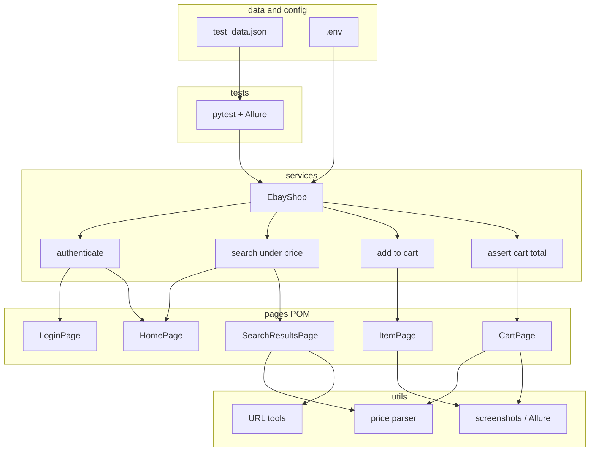
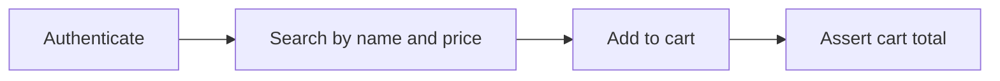

# ebay


[](https://github.com/shlomi10/ebay/actions/workflows/e2e.yml)


End-to-end automation for [ebay.com](https://www.ebay.com/): search by name and price, add items to the cart, and assert that the cart total does not exceed the budget.

Repository:

```bash
https://github.com/shlomi10/ebay
```

> Captcha is not handled. If a challenge or block appears, the test continues as a guest.

---

## Overview

The framework drives a live ebay shopping flow with **Python**, **Playwright**, **Pytest**, and **Allure**.

Core product flow:

```text
Authenticate (guest) → Search by name → Filter by max price → Add items to cart → Assert cart total ≤ budget
```

This project includes:

- UI automation against ebay.com
- Page Object Model for Home, Login, Search, Item, and Cart
- Scenario layer (`EbayShop`) with the four required shopping functions
- Data-driven cases from JSON
- Settings from `.env` (local) and GitHub Actions `env` (CI)
- Allure reporting
- pytest-html report
- Failure screenshots
- Playwright traces
- Runtime logs

---

## Automated scenario

### E2E — Search, add to cart, budget

Automated through the frontend.

Flow:

```text
Open ebay.com as guest
Search by query from test data
Apply max-price / Buy It Now / free-shipping filters
Collect item URLs under the price (paging if needed)
Open each item in a new tab
Select required variants when the listing asks
Add items to cart until the case limit is reached
Open the cart
Read the items total (not shipping)
Assert total ≤ max_price * items_added
```

Test file:

```text
tests/test_ebay_cart_e2e.py
```

Price-parser unit tests:

```text
tests/test_price_parser.py
```

---

## Project structure

```text
ebay/
├── .github/workflows/e2e.yml
├── config/
│   └── settings.py
├── data/
│   └── test_data.json
├── pages/
│   ├── base_page.py
│   ├── login_page.py
│   ├── home_page.py
│   ├── search_results_page.py
│   ├── item_page.py
│   └── cart_page.py
├── services/
│   └── ebay_shop.py
├── tests/
│   ├── test_ebay_cart_e2e.py
│   └── test_price_parser.py
├── utils/
│   ├── logger.py
│   ├── price_parser.py
│   ├── reporting.py
│   └── url_tools.py
├── reports/                  (created at runtime)
│   ├── allure-results/
│   ├── allure-report/
│   ├── screenshots/
│   ├── traces/
│   └── report.html
├── conftest.py
├── pytest.ini
├── requirements.txt
├── README.md
└── ReadMeAIBugs.md
```

---

## Tech stack

- Python 3.14
- Playwright
- Pytest
- Pytest-Playwright
- Allure Pytest
- pytest-html
- Python Dotenv
- GitHub Actions

---

## Architecture





- `pages/` — Page Object Model. Each screen owns its locators and actions. Shared clicks/waits live in `BasePage`. Site-wide overlays (cookies, lightbox) are dismissed from `BasePage` because they can appear on any page.
- `services/ebay_shop.py` — Scenario layer. Implements:
  - `authenticate`
  - `search_items_by_name_under_price`
  - `add_items_to_cart`
  - `assert_cart_total_not_exceeds`
- `conftest.py` — Browser fixtures, `Pages` container, Allure/HTML attachments on pass/fail.
- `utils/` — Price parsing, URL canonicalization, screenshots, traces, logging.
- `config/settings.py` — Loads settings from `.env`.
- `tests/` — Thin Pytest tests that call `EbayShop`.

The UI test only describes the business flow. `page_setup` groups all page objects for the test.

---

## Prerequisites

- Python 3.14
- Git
- Chromium via Playwright
- [Allure CLI](https://allurereport.org/docs/install/) if you want to open the Allure HTML report (`allure --version`)

---

## Environment variables

Create `.env` in the project root (already used locally; not committed):

```env
EBAY_BASE_URL=https://www.ebay.com
EBAY_CART_URL=https://cart.ebay.com/
EBAY_TIMEOUT_MS=30000
EBAY_BUY_IT_NOW_ONLY=true
EBAY_FREE_SHIPPING_ONLY=true
EBAY_USER=
EBAY_PASS=
HEADLESS=false
```

- Guest mode is used when `EBAY_USER` / `EBAY_PASS` are empty.
- Local profile = `.env`
- CI profile = `env` in `.github/workflows/e2e.yml`

`.env` should not be committed.

---

## Installation

Clone the repository:

```bash
git clone https://github.com/shlomi10/ebay.git
cd ebay
```

Create a virtual environment:

```bash
python -m venv .venv
```

Activate it on Windows PowerShell:

```powershell
.\.venv\Scripts\Activate.ps1
```

Install dependencies:

```bash
pip install -r requirements.txt
```

Install Playwright browsers:

```bash
playwright install chromium
```

---

## Running tests

Headed (default, better against ebay bot checks):

```powershell
pytest --headed
```

Headless:

```powershell
$env:HEADLESS="true"
pytest
```

E2E only:

```bash
pytest -m e2e --headed
```

One data-driven case:

```powershell
pytest -k usb_cable_under_10 --headed
```

Price parser only:

```bash
pytest tests/test_price_parser.py
```

Verbose:

```bash
pytest -v
```

Every run creates `reports/`, including Allure results at `reports/allure-results`.

---

## Allure report

`pytest.ini` already sets `--alluredir=reports/allure-results`.

1. Install Allure CLI and check it:

```bash
allure --version
```

2. Run tests (writes results into `reports/allure-results`):

```powershell
.\.venv\Scripts\Activate.ps1
pytest --headed --alluredir=reports/allure-results
```

3. Build the HTML report:

```bash
allure generate reports/allure-results -o reports/allure-report --clean
```

4. Open the report:

```bash
allure open reports/allure-report
```

Quick view without keeping the HTML folder (stops when you close the process):

```bash
allure serve reports/allure-results
```

---

## HTML report

`pytest.ini` already writes a standalone HTML report. After any `pytest` run:

```text
reports/report.html
```

Open that file in a browser.

Generate it explicitly:

```bash
pytest --html=reports/report.html --self-contained-html
```

Required package: `pytest-html`.

---

## Runtime artifacts

```text
reports/
├── allure-results/
├── allure-report/
├── report.html
├── screenshots/
│   └── cart-total.png
└── traces/
    └── cart-total.zip
```

On failure, `conftest.py` also attaches a screenshot and browser log to Allure and pytest-html.

Open a Playwright trace:

```bash
playwright show-trace reports/traces/cart-total.zip
```

---

## Test data

Edit `data/test_data.json`. Pytest builds one test per `cases[]` entry.

```json
{
  "cases": [
    {
      "name": "usb_cable_under_10",
      "query": "usb c cable",
      "max_price": 5,
      "limit": 2
    },
    {
      "name": "shoes_under_60",
      "query": "shoes",
      "max_price": 60,
      "limit": 1
    }
  ]
}
```

- `query` — search text
- `max_price` — UI/URL price filter and budget per item
- `limit` — how many items to add to the cart
- `name` — Pytest test id

---

## GitHub Actions

Workflow: [`.github/workflows/e2e.yml`](https://github.com/shlomi10/ebay/blob/main/.github/workflows/e2e.yml)

Runs on push, pull request, and `workflow_dispatch`, in headless mode.

When the job finishes, download the `reports` artifact from the Actions run (pytest-html + Allure HTML + screenshots/traces). Reports are uploaded even if tests fail (`if: always()`).

Optional login secrets: repo **Settings → Secrets and variables → Actions** → `EBAY_USER` and `EBAY_PASS`.

ebay often blocks datacenter IPs. E2E tests may fail on GitHub runners even when they pass locally.

---

## Pytest configuration

`pytest.ini`:

```ini
[pytest]
pythonpath = .
testpaths = tests
addopts = -v --alluredir=reports/allure-results --html=reports/report.html --self-contained-html --screenshot=only-on-failure --video=retain-on-failure --tracing=retain-on-failure
markers =
    e2e: end-to-end ebay shopping flow
```

---

## Limitations and assumptions

- Default is guest. Real login runs only if `EBAY_USER` and `EBAY_PASS` are set. There is no Captcha solver.
- Buy It Now is enabled to increase the chance of Add to cart (not an auction).
- The cart assertion uses the items total (`Items (N)`), without shipping or tax. The limit is `max_price * item_count`.
- The `_udhi` filter on ebay.com is usually USD. The UI may show ILS depending on location. If a Ship to form is already open, the code fills United States.
- ebay changes its DOM often. Locators use fallbacks.
- If a search page does not have enough items under the price, the code pages forward and returns whatever was found.
- Variants (size/color) are chosen at random from the available options.

---

## Notes

- `.env` is for local values through `config/settings.py`.
- CI values live on the GitHub Actions workflow, not in a committed `.env`.
- UI tests use the `page_setup` fixture.
- Runtime artifacts are generated automatically under `reports/`.
- A static review of a broken AI-generated snippet is in `ReadMeAIBugs.md`.

---

## Useful commands

```bash
pytest --headed
pytest -m e2e --headed
pytest -k usb_cable_under_10 --headed
pytest --alluredir=reports/allure-results
pytest --html=reports/report.html --self-contained-html
allure generate reports/allure-results -o reports/allure-report --clean
allure open reports/allure-report
allure serve reports/allure-results
playwright show-trace reports/traces/cart-total.zip
```

---

## ❤️ Made By

Built by **Shlomi** — from code to the world, with love.
